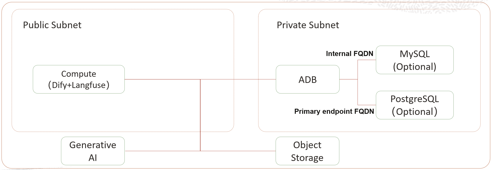

# No.1-ADB-SelectAI-Sidecar

Deploy Oracle Autonomous Database (ADB) Select AI Sidecar and Dify on Oracle Cloud Infrastructure (OCI)

## Deploy

  

## Architecture

### Prerequisites

* **API Key**: For OCI GenAI authentication
* **Customer Secret Key**: For OCI Object Storage S3-Compatible API authentication
* **SSH Key**: For creating and accessing OCI Compute Instances
* **VCN**: Required for ADB access, MySQL creation, PostgreSQL creation, and Compute Instance creation
* **Security List Configuration**

**Public**

* `0.0.0.0/0` (or specific IP) – TCP 8080: Dify Console URL
* `0.0.0.0/0` (or specific IP) – TCP 5001: Dify File Server URL
* `0.0.0.0/0` (or specific IP) – TCP 3100: Langfuse URL

**Private**

* `10.0.0.0/16` – TCP 1522: ADB
* `10.0.0.0/16` – TCP 3306: MySQL
* `10.0.0.0/16` – TCP 5432: PostgreSQL

